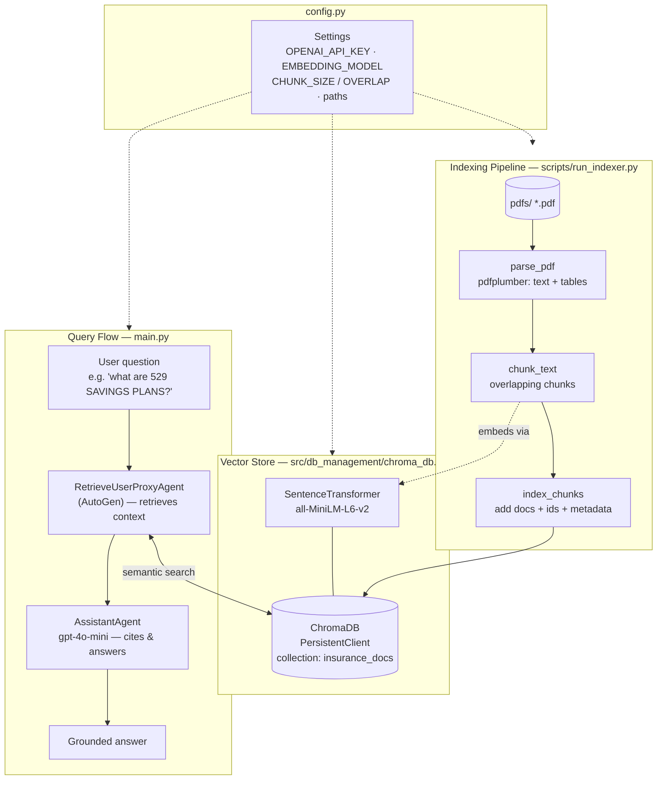

# RAG-Trinity — Insurance Policy RAG Agent

Small Python RAG app. Ask questions about insurance PDFs, get cited answers. Uses **Autogen** agents + **ChromaDB** vector store.

## Flow

```
PDFs → parse → chunk → embed → ChromaDB → agent retrieves → LLM answers
```

## Architecture



**1. Index** (`scripts/run_indexer.py`) — run once first:

- `process_single_pdf` (`src/data_processing/processor.py`) — pdfplumber pulls text + tables per page, then `RecursiveCharacterTextSplitter` cuts into 1000-char chunks, 200 overlap.
- `index_chunks` (`src/db_management/chroma_db.py`) — embeds chunks with `all-MiniLM-L6-v2` (sentence-transformers, local), stores in persistent ChromaDB collection `insurance_docs`.

**2. Ask** (`main.py`):

- Opens same ChromaDB collection.
- `setup_rag_agents` (`src/agents/rag_agents.py`) builds two Autogen agents:
  - `RetrieveUserProxyAgent` — retrieves relevant chunks from Chroma.
  - `AssistantAgent` — LLM writes final answer, cites snippets.
- `initiate_chat` fires a hardcoded question ("what are the 529 SAVINGS PLANS?").

## Pieces

| File | Job |
|------|-----|
| `config.py` | keys, paths, chunk sizes, model names, prompt |
| `src/data_processing/processor.py` | PDF → text → chunks |
| `src/db_management/chroma_db.py` | vector DB client + index |
| `src/agents/rag_agents.py` | Autogen retrieval + assistant agents |
| `main.py` | run the chat |
| `Dockerfile` | python:3.10-slim container |

## Config knobs (`config.py`)

- `EMBEDDING_MODEL = "all-MiniLM-L6-v2"` — local sentence-transformers embeddings.
- `CHUNK_SIZE = 1000`, `CHUNK_OVERLAP = 200`.
- `CHROMA_COLLECTION_NAME = "insurance_docs"`.
- `LLM_CONFIG_LIST` — model `gpt-4o-mini`, OpenAI API.

## Confused naming

"Claude/Anthropic" comments in config, but code uses **OpenAI** `gpt-4o-mini` + `OPENAI_API_KEY`. Autogen talks OpenAI API. No Anthropic actually wired. Comments are leftover cruft.

## Run

```bash
pip install -r requirements.txt
export OPENAI_API_KEY="your-key"   # do NOT hardcode
# drop PDFs into pdfs/
python scripts/run_indexer.py      # build vector DB
python main.py                     # ask
```
