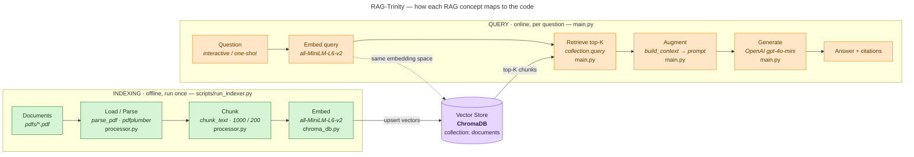

# RAG-Trinity — Insurance Policy RAG Agent

Small Python RAG app. Ask questions about insurance PDFs, get cited answers. Uses **Autogen** agents + **ChromaDB** vector store.

## Flow

```
PDFs → parse → chunk → embed → ChromaDB → agent retrieves → LLM answers
```

## Architecture — how each RAG concept maps to the code



> Green = offline indexing (retrieve step is built here), purple = the shared vector store, orange = online query (retrieve → augment → generate). Each box names the RAG concept and the code that implements it.

**0. (Optional) Grab web pages as PDFs** (`scripts/url_to_pdf.py`):

- Single page: `python scripts/url_to_pdf.py https://example.com`
- Whole site (follows all same-domain links): `python scripts/url_to_pdf.py https://example.com --crawl`
- Saves one PDF per page into `pdfs/` (uses headless Chromium via Playwright).

**1. Index ALL PDFs** (`scripts/run_indexer.py`) — run after adding/updating PDFs:

- Loops over **every** `*.pdf` in `pdfs/`.
- `process_single_pdf` (`src/data_processing/processor.py`) — pdfplumber pulls text + tables per page, then `chunk_text` cuts into 1000-char chunks, 200 overlap.
- `index_chunks` (`src/db_management/chroma_db.py`) — embeds chunks with `all-MiniLM-L6-v2` (sentence-transformers, local) and **upserts** into the persistent ChromaDB collection `documents` (idempotent, so re-running just adds new files).

**2. Ask across all PDFs** (`main.py`):

- Opens the same ChromaDB collection (every indexed PDF).
- Retrieves the top-`TOP_K` most relevant chunks **from across all documents**.
- Sends them to the LLM (`gpt-4o-mini`) which answers and cites the source file(s).
- Interactive loop, or one-shot: `python main.py "your question"`.

## Pieces

| File | Job |
|------|-----|
| `config.py` | key, paths, chunk sizes, model, prompt, `TOP_K` |
| `scripts/url_to_pdf.py` | URL/site → PDF into `pdfs/` |
| `scripts/run_indexer.py` | index every PDF in `pdfs/` |
| `src/data_processing/processor.py` | PDF → text → chunks |
| `src/db_management/chroma_db.py` | vector DB client + upsert index |
| `main.py` | ask questions across all PDFs |
| `src/agents/rag_agents.py` | legacy AutoGen agents (no longer used by `main.py`) |
| `Dockerfile` | python:3.10-slim container |

## Config knobs (`config.py`)

- `EMBEDDING_MODEL = "all-MiniLM-L6-v2"` — local sentence-transformers embeddings.
- `CHUNK_SIZE = 1000`, `CHUNK_OVERLAP = 200`.
- `CHROMA_COLLECTION_NAME = "documents"`.
- `TOP_K = 8` — chunks retrieved per question.
- `LLM_MODEL = "gpt-4o-mini"` — OpenAI chat model.

## Run

```bash
pip install -r requirements.txt
playwright install chromium          # only if you use scripts/url_to_pdf.py

# (optional) pull a site into pdfs/
python scripts/url_to_pdf.py https://example.com --crawl

# index needs NO API key (local embeddings)
python scripts/run_indexer.py        # build/refresh vector DB from ALL pdfs

# asking needs your key
export OPENAI_API_KEY="your-key"     # do NOT hardcode
python main.py                       # interactive Q&A across all PDFs
python main.py "what does the site say about leasing?"
```
